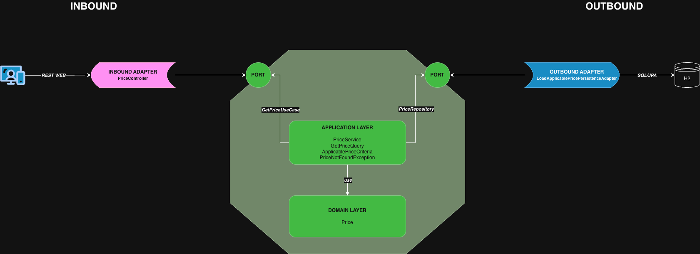
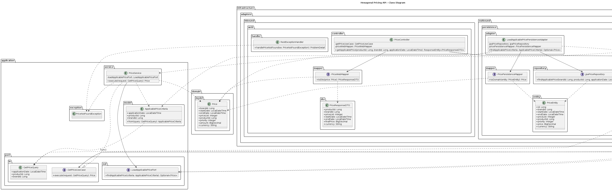
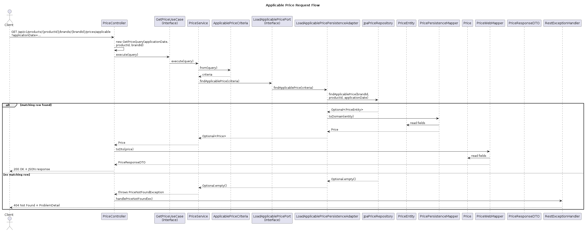
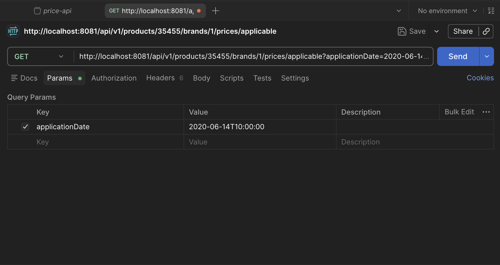

# Engineering Paper

## Hexagonal Pricing API

Spring Boot microservice that exposes a REST endpoint to retrieve the applicable price for a product and brand at a given date.

The service is implemented using **hexagonal architecture (ports and adapters)** so that the application core remains isolated from REST, JPA, and H2 concerns.



---

## 1. Functional goal

The API must:

- accept:
  - application date
  - product identifier
  - brand identifier
- return:
  - product identifier
  - brand identifier
  - price list to apply
  - validity dates
  - final price

Pricing rule:

> when several prices are valid for the same product, brand, and date, the one with the **highest priority** must be applied.

The database is initialized with the sample data provided in the exercise by using an **in-memory H2 database**.

---

## 2. Architectural style

This project follows **Hexagonal Architecture**, also known as **Ports and Adapters**.

The main idea is:

- the **core** contains business concepts and use cases
- technical details are isolated in **adapters**
- dependencies point **inward**, toward the application core

Benefits:

- business logic is independent from frameworks
- the use case is easier to test
- infrastructure can evolve without changing the core
- responsibilities are explicit

---

## 3. Technologies used

The project is built with the following technologies:

- **Java 25** as the programming language
- **Spring Boot 4** for application bootstrap and dependency injection
- **Spring Web MVC** for the REST API layer
- **Spring Data JPA** for persistence access
- **H2** as the in-memory database used for the exercise
- **MapStruct** for DTO and entity mapping
- **JUnit 5** for testing
- **Mockito** for unit test mocking
- **Maven** as the build tool

---

## 4. Package structure

```text
src/main/java/com/retail/pricing
│
├── application
│   ├── exception
│   │   └── PriceNotFoundException.java
│   ├── model
│   │   └── ApplicablePriceCriteria.java
│   ├── port
│   │   ├── in
│   │   │   ├── GetPriceQuery.java
│   │   │   └── GetPriceUseCase.java
│   │   └── out
│   │       └── LoadApplicablePricePort.java
│   └── service
│       └── PriceService.java
│
├── domain
│   └── model
│       └── Price.java
│
├── infrastructure
│   ├── adapters
│   │   ├── inbound
│   │   │   └── web
│   │   │       ├── controller
│   │   │       │   └── PriceController.java
│   │   │       ├── dto
│   │   │       │   └── PriceResponseDTO.java
│   │   │       ├── handler
│   │   │       │   └── RestExceptionHandler.java
│   │   │       └── mapper
│   │   │           └── PriceWebMapper.java
│   │   └── outbound
│   │       └── persistence
│   │           ├── adapter
│   │           │   └── LoadApplicablePricePersistenceAdapter.java
│   │           ├── entity
│   │           │   └── PriceEntity.java
│   │           ├── mapper
│   │           │   └── PricePersistenceMapper.java
│   │           └── repository
│   │               └── JpaPriceRepository.java
│   └── configuration
│       └── ApplicationConfiguration.java
│
└── PricingApplication.java
```

---

## 5. Layer responsibilities



### 5.1 Domain layer

The domain layer contains the business representation of price data.

**Price**

Represents the applicable price returned by the business use case.

It contains only business data:

- brand
- validity dates
- price list
- product
- priority
- amount
- currency

It is intentionally framework-free:

- no JPA annotations
- no Spring annotations
- no persistence concerns

### 5.2 Application layer

The application layer defines the use case and orchestrates the pricing query.

**GetPriceUseCase**

Inbound port exposed to external callers.

```java
Price execute(GetPriceQuery request);
```

**GetPriceQuery**

Input model for the use case:

- application date
- product id
- brand id

**LoadApplicablePricePort**

Outbound port used by the application to ask for the applicable price from a persistence source.

**ApplicablePriceCriteria**

Application-level search criteria used by outbound adapters. It keeps the outbound port independent from inbound web concerns.

**PriceService**

Use case implementation.

Responsibilities:

- receive a `GetPriceQuery`
- transform it into outbound criteria
- ask the outbound port for the applicable price
- throw `PriceNotFoundException` when no price exists
- return the selected domain object

**PriceNotFoundException**

Application exception raised when no price matches the request.

### 5.3 Infrastructure layer

The infrastructure layer contains technical implementations.

It is split into inbound and outbound adapters.

---

## 6. Inbound adapter design

Inbound adapters are the entry points into the application.

In this project, the inbound adapter is a REST API.

**PriceController**

Receives HTTP requests and maps them to the use case.

Responsibilities:

- parse path variables and query parameters
- create a `GetPriceQuery`
- call `GetPriceUseCase`
- map the domain response to an API DTO

It intentionally does not contain business rules.

**PriceResponseDTO**

Represents the REST response payload.

It is separate from the domain model because:

- API contracts may evolve differently from the domain
- external naming can differ from internal naming
- it avoids exposing domain structures directly

**PriceWebMapper**

MapStruct mapper converting:

`Price -> PriceResponseDTO`

**RestExceptionHandler**

Centralized exception mapping for REST errors.

Responsibilities:

- translate application exceptions into HTTP responses
- keep controllers simple
- ensure consistent API error behavior

---

## 7. Outbound adapter design

Outbound adapters implement technical access to external systems.

In this project, the external system is the database.

**JpaPriceRepository**

Spring Data JPA repository used to retrieve the highest-priority valid row directly from the database.

The selected query strategy is:

> ask the database to directly return the highest-priority valid row

This avoids loading multiple candidates into Java when only one applicable price is required.

**PriceEntity**

JPA representation of the `prices` table.

It exists only for persistence concerns:

- table mapping
- column mapping
- JPA lifecycle

**PricePersistenceMapper**

MapStruct mapper converting:

`PriceEntity -> Price`

**LoadApplicablePricePersistenceAdapter**

Implements `LoadApplicablePricePort` using JPA.

Responsibilities:

- receive `ApplicablePriceCriteria`
- call `JpaPriceRepository`
- map `PriceEntity` to `Price`
- return `Optional<Price>`

---

## 8. API design

Endpoint:

```text
GET /api/v1/products/{productId}/brands/{brandId}/prices/applicable
```

Query parameters:

- `applicationDate`

Example request:

```text
GET /api/v1/products/35455/brands/1/prices/applicable?applicationDate=2020-06-14T16:00:00
```

Example response:

```json
{
  "productId": 35455,
  "brandId": 1,
  "priceList": 2,
  "startDate": "2020-06-14T15:00:00",
  "endDate": "2020-06-14T18:30:00",
  "finalPrice": 25.45,
  "currency": "EUR"
}
```

Error response:

If no price exists for the request, the API returns `404 Not Found`.

---

## 9. Request flow



Runtime flow:

- client calls the REST endpoint
- `PriceController` receives the request
- controller creates `GetPriceQuery`
- controller calls `GetPriceUseCase`
- `PriceService` orchestrates the use case
- `PriceService` calls `LoadApplicablePricePort`
- `LoadApplicablePricePersistenceAdapter` implements the port
- adapter calls `JpaPriceRepository`
- JPA queries H2
- entity is mapped to domain
- domain model is mapped to response DTO
- response is returned to the client

This shows the dependency direction:

- adapters depend on core contracts
- the core does not depend on adapters

---

## 10. Testing strategy

The project uses a layered testing strategy.

**Unit tests**

Focused on application behavior:

- `PriceServiceTest`

These tests validate:

- correct result returned
- exception thrown when not found

**Repository integration tests**

Focused on JPA query correctness with H2:

- `JpaLoadApplicablePricePortIntegrationTest`

These validate:

- date range filtering
- product filtering
- brand filtering
- highest priority selection

**Full API integration tests**

Focused on end-to-end behavior:

- `PriceApiIntegrationTest`

These validate the 5 required scenarios from the exercise:

- 2020-06-14 10:00
- 2020-06-14 16:00
- 2020-06-14 21:00
- 2020-06-15 10:00
- 2020-06-16 21:00

---

## 11. Running the API

### Prerequisites

Before running the application, make sure the following tools are installed:

- Java 25
- Maven 3.9+ or use the included Maven Wrapper

Start the application from the `pricing` directory:

```text
./mvnw spring-boot:run
```

The application starts on:

```text
http://localhost:8081
```



---

## 12. Main design decisions summary

1. **Hexagonal architecture**: isolates business logic from technical concerns.
2. **Application ports**: make dependency direction explicit.
3. **Separate domain and persistence models**: keep JPA concerns out of the core.
4. **Single-result repository query**: the requirement expects one applicable price.
5. **Database-side selection**: filtering and priority selection happen where the data lives.
6. **MapStruct for mapping**: reduces boilerplate and keeps translation explicit.
7. **H2 initialization with SQL scripts**: deterministic setup aligned with the exercise.
8. **Thin controller**: keeps REST concerns separate from business rules.

---

## 13. Branching strategy note

For this exercise, the focus was placed on architecture, code quality, and test coverage rather than on repository workflow governance.

That said, for a real team project, it would be beneficial to apply a lightweight branching strategy to make changes easier to review and maintain over time.

A simple convention could be:

- `feat/...` for new functionality
- `fix/...` for bug fixes
- `refactor/...` for internal code improvements
- `docs/...` for documentation updates

As a future improvement, this repository could adopt a more formal Git strategy such as GitFlow or a lightweight trunk-based variation depending on the team context and release process.

---

## 14. Trade-offs

This design is intentionally simple for the current scope.

Strengths:

- clear separation of concerns
- easy to understand
- easy to test
- easy to extend
- efficient query for the main use case

Possible future improvements:

- add request validation objects for the web layer
- add OpenAPI documentation
- improve observability and logging
- add coverage reporting
